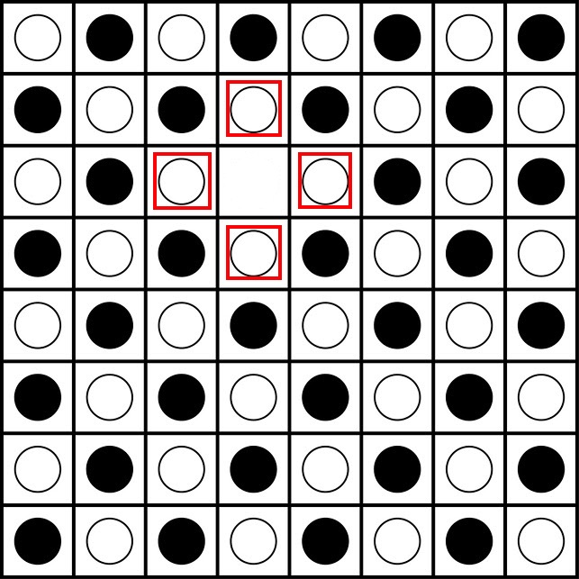
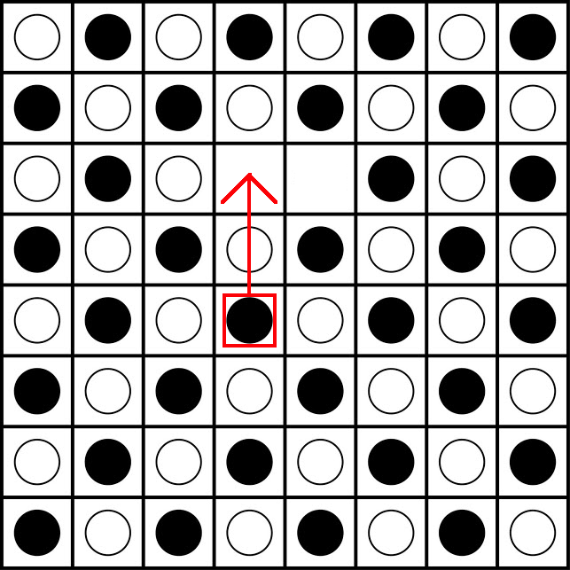

# Christopher_Tsai_CS348
 Repo for my CS 348 Introduction to AI course assignments.

# Assignment 1: Knowledge Base Basics

In this lab assignment, you are going to create a basic knowledge base (KB) to store and retrieve facts. The facts will be statements that includes predicates (e.g., Color, Size, Inst) that relate objects together.  For example:

Block1 is an instance of a rectangle.
- Inst(block1, rectangle)

Block1 is red
- Color(block1, red)

Block1 is large
- Size(block1, large)

Rectangles are blocks
- Isa(rectangle, block)

The knowledge base supports two main interfaces: `Assert`and `Ask`.

- `Assert`: Add facts into the knowledge base.
- `Ask`: ask queries and return a list of bindings for facts.

## Starter code

We provide you five files with code: `main.py`, `logical_classes.py`, `read.py`, `util.py` and `student_code.py`. (Details about these files are described at the end of this write-up.)

- `main.py` contains code for testing the KnowledgeBase
- `student_code.py` contains the `KnowledgeBase` class and is where you will be writing code.
- `logical_classes.py` contains classes for each type of logical component, e.g. `Fact`, `Rule`, etc.
- `util.py` contains several useful helper functions
- `read.py` contains functions that read statements from files or terminal. (You won't need to read/explore this file.)

There are also two data files: `statements_kb.txt` and `statements_kb2.txt`.  These files contain the facts and rules to be inserted into the KB. The provided tests use `statements_kb.txt`, and you may use `statements_kb2.txt` to generate your own tests.

## Your task

To get you started, the stubbed out code for the `KnowledgeBase.kb_assert` and `KnowledgeBase.kb_ask` methods are in `student_code.py`.  These methods are called by the tests in `main.py`.

Your task is two-part:

1. Implement storing facts in the KB
2. Implement retrieving facts from the KB

## Storing facts

Storing facts simply puts any new facts received into a list of facts.  Do not store a fact if it is already in the KB. Be careful to only put a Fact in the list and not just anything (i.e., check that the argument is a Fact).  Note that we expect the facts to be stored in a list (and not a set) to ensure that they are retrieved in a deterministic order.  This is not criticial to the function of the KB but is essential for the Auto Grader.

### Retrieving facts

The key idea is to find any facts in the KB that match the "asked" for fact.  Since the queried fact may contain a variable, matching facts might not be exact matches.  To help in finding matching facts, we provide a `match` method in `util.py`.  If a pair of facts match, then this method will return the `Bindings` that make the statements unify.

`Bindings` is a list of pairs (binding), where each pair is a variable (e.g., '?X') and a value (e.g., 'red').  Since it is a list, there may be multiple pairs.  Actually, there needs to be exactly one binding for each variable.  For example, in asking for '(color ?X red)', there will be only one binding, the one for '?X'.  But the query for '(color ?X ?Y)'' will result in bindings for '?X' and '?Y'.  See test 5 for an example of bindings containing more than one variable.

Since there may be many facts that match a queried fact, `kb_ask` needs to return a `ListOfBindings` (or False if no matching facts).  The ListOfBindings is exactly as the name implies, a list of Bindings, packaged up in a class with convenient accessors and such.  See tests 3 and 5 for examples of multiple bindings being returned from `kb_ask`.


### Testing

To test this lab, we'll create several testing files that contain a bunch of facts (similar to the ones provided). Each fact will be asserted one-by-one into the KB. After asserting the facts, a query will be constructed and the KB will be asked for a fact.  **We strongly recommend you make your own testing files. Please feel free to share them on Piazza.**. When sharing tests, please provide your rationale to the test, explain what you hope to test and/or how you developed the test.

## Looking ahead

Next week, we will be extending the KB.  We will introduce Rules which may also be asserted.  Given the Rules and Facts asserted, we will infer new Facts.  Finally, we will retract some facts and related facts that have been inferred.

As you implement this week's assignment, you may want to think ahead to how you would extend the KB to handle rules, inference, and retraction.  


\pagebreak

# Appendix: File Breakdown

Below is a description of each included file and the classes contained within each including a listing of their attributes. Each file has documentation in the code reflecting the information below (in most cases they are exactly the same). As you read through the attributes follow along in the corresponding files and make sure you're understanding the descriptions.

Attributes of each class are listed in the following format (_Note:_ if you see a type like `Fact|Rule` the `|` type is `or` and mean the type can be either Fact or Rule):

- `field_name` (`type`) - text description

## logical_classes.py

This file defines all basic structure classes.

### Fact

Represents a fact in our knowledge base. Has a statement containing the content of the fact, e.g. (isa Sorceress Wizard) and fields tracking which facts/rules in the KB it supports and is supported by.

**Attributes**

- `name` (`str`): 'fact', the name of this class
- `statement` (`Statement`): statement of this fact, basically what the fact actually says
- `asserted` (`bool`): flag indicating if fact was asserted instead of inferred from other rules in the KB
- `supported_by` (`listof Fact|Rule`): Facts/Rules that allow inference of the statement
- `supports_facts` (`listof Fact`): Facts that this fact supports
- `supports_rules` (`listof Rule`): Rules that this fact supports

### Rule

Represents a rule in our knowledge base. Has a list of statements (the LHS) containing the statements that need to be in our KB for us to infer the RHS statement. Also has fields tracking which facts/rules in the KB it supports and is supported by.

**Attributes**

- `name` (`str`): 'rule', the name of this class
- `lhs` (`listof Statement`): LHS statements of this rule
- `rhs` (`Statement`): RHS statment of this rule
- `asserted` (`bool`): flag indicating if rule was asserted instead of inferred from other rules/facts in the KB
- `supported_by` (`listof Fact|Rule`): Facts/Rules that allow inference of the statement
- `supports_facts` (`listof Fact`): Facts that this rule supports
- `supports_rules` (`listof Rule`): Rules that this rule supports

### Statement

Represents a statement in our knowledge base, e.g. (attacked Ai Nosliw), (diamonds Loot), (isa Sorceress Wizard), etc. These statements show up in Facts or on the LHS and RHS of Rules.

**Attributes**

- `predicate` (`str`) - the predicate of the statement, e.g. isa, hero, needs
- `terms` (`listof Term`) - list of terms (Variable or Constant) in the statement, e.g. `'Nosliw'` or `'?d'`

### Term

Represents a term (a Variable or Constant) in our knowledge base. It could be thought of as a super class of Variable and Constant, though there is no actual inheritance implemented in the code.

**Attributes**

- `term` (`Variable|Constant`) - The Variable or Constant that this term holds (represents)

### Variable

Represents a variable used in statements, e.g. `?x`.

**Attributes**

- `element` (`str`): The name of the variable, e.g. `'?x'`

### Constant

Represents a constant used in statements

**Attributes**

- `element` (`str`): The value of the constant, e.g. `'Nosliw'`

### Binding

Represents a binding of a constant to a variable, e.g. `'Nosliw'` might be bound to `'?d'`

**Attributes**

- `variable` (`str`): The name of the variable associated with this binding, e.g. `'?d'`
- `constant` (`str`): The value of the variable, e.g. `'Nosliw'`

### Bindings

Represents Binding(s) used while matching two statements

**Attributes**

- `bindings` (`listof Bindings`) - bindings involved in match
- `bindings_dict` (`dictof Bindings`) - bindings involved in match where key is bound variable and value is bound value, e.g. some_bindings.bindings_dict['?d'] => 'Nosliw'

**Methods**

- `add_binding(variable, value)` (`(Variable, Constant) => void`) - add a binding from a variable to a value
- `bound_to(variable)` (`(Variable) => Variable|Constant|False`) - check if variable is bound. If so return value bound to it, else False
- `test_and_bind(variable_verm,value_term)` (`(Term, Term) => bool`) - Check if variable_term already bound. If so return whether or not passed in value_term matches bound value. If not, add binding between variable_terma and value_term and return True.

### ListOfBindings

Container for multiple Bindings

**Methods**

- `add_bindings(bindings, facts_rules)` - (`(Bindings, listof Fact|Rule) => void`) - add given bindings to list of Bindings along with associated rules or facts

## read.py

This file has no classes but defines useful helper functions for reading input from the user or a file.

**Functions**

- `read_tokenize(file)` - (`(str) => (listof Fact, listof Rule)`) - takes a filename, reads the file and returns a fact list and rule list.
- `parse_input(e)` - (`(str) => (int, str | listof str)`) - parses input, cleaning it as it does and assigning labels

## util.py

This file has no classes but defines useful helper functions.

**Functions**

- `is_var(var)` (`(str|Variable|Constant|Term) => bool`) - check whether an element is a variable (either instance of Variable or string starting with `'?'`, e.g. `'?d'`)
- `match(state1, state2, bindings=None)` (`(Statement, Statement, Bindings) => Bindings|False`) - match two statements and return the associated bindings or False if there is no binding
- `match_recursive(terms1, terms2, bindings)` (`(listof Term, listof Term, Bindings) => Bindings|False`) - recursive helper for match
- `instantiate(statement, bindings)` (`(Statement, Bindings) => Statement|Term`)  - generate Statement from given statement and bindings. Constructed statement has bound values for variables if they exist in bindings.
- `vprint(message, level, verbose, data=[])` (`(str, int, int, listof any) => void`) - prints message if verbose > level, if data provided then formats message with given data

## student_code.py

This file defines the two classes you must implement, KnowledgeBase and InferenceEngine.

### KnowledgeBase

Represents a knowledge base and contains the two methods described in the writeup (`Assert` and `Ask`)
#
#
#
#
# Assignment 2: Knowledge Base: Rules

In this lab assignment, you are going to extend a knowledge base (KB) and an inference engine. The knowledge base supports three main interfaces: `Assert`, `Retract`, and `Ask`.

- `Assert`: Add facts or rules into the knowledge base. After you add facts or rules into the KB, the forward-chaining algorithm is used to infer other facts or rules.
- `Ask`: ask queries and return a list of bindings for facts.
- `Retract`: remove asserted facts from the knowledge base. Also, remove all other facts or rules that are dependent on the removed fact or rule.

The end result of this assignment is a KB that can be used to model a world/game/thing with a static set of rules. Most board games and established businesses (during a short period of time) fell into this category. In this type of KB, asserted rules should be treated as laws, laying the foundation of the game/business logic; they are unquestionable and therefore must never be removed from the KB. Asserted facts could be treated as factual observations about the state of the world/game/thing, situations which hold until they cease to be valid -- when they are retracted by us, the users. Inferred facts and rules should be thought of as hypotheses: things you write on a scratch paper when solving a problem. They should be generated when there are enough supporting evidences and removed as soon as *any* supporting evidence is retracted.

## Starter code

We provide you five files with code: `main.py`, `logical_classes.py`, `read.py`, `util.py` and `student_code.py`. (Details about these files are described at the end of this write-up.)

- `main.py` contains code for testing the KnowledgeBase
- `student_code.py` contains the `KnowledgeBase` and `InferenceEngine` classes, and is where you will be writing code.
- `logical_classes.py` contains classes for each type of logical component, e.g. `Fact`, `Rule`, etc.
- `util.py` contains several useful helper functions
- `read.py` contains functions that read statements from files or terminal. (You won't need to read/explore this file.)

There are also two data files: `statements_kb.txt` and `statements_kb2.txt`.  These files contain the facts and rules to be inserted into the KB. The provided tests use `statements_kb2.txt`, and you may use `statements_kb.txt` to generate your own tests.

## Your task

To get you started, the `Assert` and `Ask` interfaces have been written - exposed via the `KnowledgeBase.kb_assert` and `KnowledgeBase.kb_ask` methods.

Your task is two-part:

1. Implement the forward-chaining inferences that occurs upon asserting facts and rules into the KB - i.e., implement the `InferenceEnginer.fc_infer` method.
2. Implement the `Retract` interface to remove facts from the KB - i.e., implement the `KnowledgeBase.kb_retract` method.

### Rule currying in `fc_infer`

The key idea is that we don't just infer new facts - we can infer new rules.

When we add a new fact to the KB, we check to see if it triggers any rule(s). When we add a new rule, we check to see if it's triggered by existing facts.

However, a rule might have multiple statements on its left-hand side (LHS), and we don't want to iterate each of these statements every time we add a new fact to the KB. Instead, we'll employ a cool trick. Whenever we add a new rule, we'll only check the first element of the LHS of that rule against the facts in our KB. (If we add a new fact, we'll reverse this - we'll examine each rule in our KB, and check the first element of its LHS against this new fact.) If there's a match with this first element, we'll add a new rule paired with *bindings* for that match.

For example, imagine a box-world. Consider a rule stating that if a box `?x` is larger than another box `?y`, and box `?x` is on box `?y`, then box `?y` is covered. Formally, that looks like:

```
((sizeIsLess(?y, ?x), on(?x, ?y)) => covered(?y))
```

Now imagine that we know that box `A` is bigger than box `B`; i.e. that we have the fact `sizeIsLess(B, A)` in the KB. The above rule then matches, with the bindings `((?x: A, ?y: B))`. With that binding in place, we can now infer a new rule that uses it:

```
(on(A, B)) => covered(B)
```

If we find the fact `on(A, B)` in the KB, then we could use this rule to infer the fact `covered(B)`. If we don't have that fact, however, we now have a simple rule that will let us make the inference easily if we see that fact in the future.

### Removing rules and facts inferred from a removed fact

When you remove a fact, you also need to remove all facts and rules that were inferred using this fact. However, a given fact/rule might be supported by multiple facts - so, you'll need to check whether the facts/rules inferred from this fact are also supported by other facts (or if they were directly asserted).

As a simplification, you can assume that **no rules will create circular dependencies**. E.g., imagine a situation like `A => B`, `B => C`, and `C => B`. Removing `A` would mean removing `B` and `C`, since they depend on `A` via those rules. However, implementing that would get messy, since `B` and `C` depend on each other. You will **NOT** be given scenarios like this.

### Testing

To grade this lab, we'll run several test cases similar to the ones provided. In each test case, facts and rules will be asserted one-by-one into the KB, and additional operations will be performed on the populated KB. Some test cases focus more on testing fc_infer while others kb_retract. Note that the test cases provided to you with this assignment are significantly less comprehensive than those from Assignment 1. **It is therefore imperative that you make your own testing files and test cases.** Please feel free to share them on Piazza. When sharing tests, please provide your rationale to the test, explain what you hope to test and/or how you developed the test.

### Hints

#### Implementing `fc_infer`

- Use the `util.match` function to do unification and create possible bindings
- Use the `util.instantiate` function to bind a variable in the rest of a rule
- `Rule`s and `Fact`s have fields for `supported_by`, `supports_facts`, and `supports_rules`. Use them to track inferences! For example, imagine that a fact `F` and rule `R` matched to infer a new fact/rule `fr`.
  - `fr` is *supported* by `F` and `R`. Add them to `fr`'s `supported_by` list - you can do this by passing them as a constructor argument when creating `fr`.
  - `F` and `R` now *support* `fr`. Add `fr` to the `supports_rules` and `supports_facts` lists (as appropriate) in `F` and `R`.

#### Implementing `kb_retract`

- An asserted fact should only be removed if it is unsupported.
- An asserted rule should never be removed.
- Use the `supports_rules` and `supports_facts` fields to find and adjust facts and rules that are supported by a retracted fact.
  - The `supported_by` lists in each fact/rule that it supports needs to be adjusted accordingly.
  - If a supported fact/rule is no longer supported as a result of retracting this fact (and is not asserted), it should also be removed.

## Appendix: File Breakdown

Below is a description of each included file and the classes contained within each including a listing of their attributes. Each file has documentation in the code reflecting the information below (in most cases they are exactly the same). As you read through the attributes follow along in the corresponding files and make sure you're understanding the descriptions.

Attributes of each class are listed in the following format (_Note:_ if you see a type like `Fact|Rule` the `|` type is `or` and mean the type can be either Fact or Rule):

- `field_name` (`type`) - text description

### logical_classes.py

This file defines all basic structure classes.

#### Fact

Represents a fact in our knowledge base. Has a statement containing the content of the fact, e.g. (isa Sorceress Wizard) and fields tracking which facts/rules in the KB it supports and is supported by.

**Attributes**

- `name` (`str`): 'fact', the name of this class
- `statement` (`Statement`): statement of this fact, basically what the fact actually says
- `asserted` (`bool`): flag indicating if fact was asserted instead of inferred from other rules in the KB
- `supported_by` (`listof Fact|Rule`): Facts/Rules that allow inference of the statement
- `supports_facts` (`listof Fact`): Facts that this fact supports
- `supports_rules` (`listof Rule`): Rules that this fact supports

#### Rule

Represents a rule in our knowledge base. Has a list of statements (the LHS) containing the statements that need to be in our KB for us to infer the RHS statement. Also has fields tracking which facts/rules in the KB it supports and is supported by.

**Attributes**

- `name` (`str`): 'rule', the name of this class
- `lhs` (`listof Statement`): LHS statements of this rule
- `rhs` (`Statement`): RHS statment of this rule
- `asserted` (`bool`): flag indicating if rule was asserted instead of inferred from other rules/facts in the KB
- `supported_by` (`listof Fact|Rule`): Facts/Rules that allow inference of the statement
- `supports_facts` (`listof Fact`): Facts that this rule supports
- `supports_rules` (`listof Rule`): Rules that this rule supports

#### Statement

Represents a statement in our knowledge base, e.g. (attacked Ai Nosliw), (diamonds Loot), (isa Sorceress Wizard), etc. These statements show up in Facts or on the LHS and RHS of Rules.

**Attributes**

- `predicate` (`str`) - the predicate of the statement, e.g. isa, hero, needs
- `terms` (`listof Term`) - list of terms (Variable or Constant) in the statement, e.g. `'Nosliw'` or `'?d'`

#### Term

Represents a term (a Variable or Constant) in our knowledge base. Can sorta be thought of as a super class of Variable and Constant, though there is no actual inheritance implemented in the code.

**Attributes**

- `term` (`Variable|Constant`) - The Variable or Constant that this term holds (represents)

#### Variable

Represents a variable used in statements, e.g. `?x`.

**Attributes**

- `element` (`str`): The name of the variable, e.g. `'?x'`

#### Constant

Represents a constant used in statements

**Attributes**

- `element` (`str`): The value of the constant, e.g. `'Nosliw'`

#### Binding

Represents a binding of a constant to a variable, e.g. `'Nosliw'` might be bound to `'?d'`

**Attributes**

- `variable` (`str`): The name of the variable associated with this binding, e.g. `'?d'`
- `constant` (`str`): The value of the variable, e.g. `'Nosliw'`

#### Bindings

Represents Binding(s) used while matching two statements

**Attributes**

- `bindings` (`listof Bindings`) - bindings involved in match
- `bindings_dict` (`dictof Bindings`) - bindings involved in match where key is bound variable and value is bound value, e.g. some_bindings.bindings_dict['?d'] => 'Nosliw'

**Methods**

- `add_binding(variable, value)` (`(Variable, Constant) => void`) - add a binding from a variable to a value
- `bound_to(variable)` (`(Variable) => Variable|Constant|False`) - check if variable is bound. If so return value bound to it, else False
- `test_and_bind(variable_verm,value_term)` (`(Term, Term) => bool`) - Check if variable_term already bound. If so return whether or not passed in value_term matches bound value. If not, add binding between variable_terma and value_term and return True.

#### ListOfBindings

Container for multiple Bindings

**Methods**

- `add_bindings(bindings, facts_rules)` - (`(Bindings, listof Fact|Rule) => void`) - add given bindings to list of Bindings along with associated rules or facts

### read.py

This file has no classes but defines useful helper functions for reading input from the user or a file.

**Functions**

- `read_tokenize(file)` - (`(str) => (listof Fact, listof Rule)`) - takes a filename, reads the file and returns a fact list and rule list.
- `read_from_input(message)` - (`(str) => str`) - collects user input from the command line.
- `parse_input(e)` - (`(str) => (int, str | listof str)`) - parses input, cleaning it as it does and assigning labels
- `get_new_fact_or_rule()` - (`() => Fact | Rule`) - get a new fact or rule by typing, nothing passed in, data comes from user input
- `get_new_statements()` - (`() => listof Statement`) - read statements from input, nothing passed in, data comes from user input

### util.py

This file has no classes but defines useful helper functions.

**Functions**

- `is_var(var)` (`(str|Variable|Constant|Term) => bool`) - check whether an element is a variable (either instance of Variable or string starting with `'?'`, e.g. `'?d'`)
- `match(state1, state2, bindings=None)` (`(Statement, Statement, Bindings) => Bindings|False`) - match two statements and return the associated bindings or False, if the statements have different structures or at least one pair of corresponding terms in the statements cannot be matched - variable from one statement cannot be bound to the constant in the same position of the other statement or different constants occupying the same positions in the two statement
- `match_recursive(terms1, terms2, bindings)` (`(listof Term, listof Term, Bindings) => Bindings|False`) - recursive helper for match
- `instantiate(statement, bindings)` (`(Statement, Bindings) => Statement|Term`)  - generate Statement from given statement and bindings. Constructed statement has bound values for variables if they exist in bindings.
- `printv(message, level, verbose, data=[])` (`(str, int, int, listof any) => void`) - prints message if verbose > level, if data provided then formats message with given data

### student_code.py

This file defines the two classes you must implement, KnowledgeBase and InferenceEngine.

#### KnowledgeBase

Represents a knowledge base and implements the three actions described in the writeup (`Assert`, `Retract` and `Ask`)

#### InferenceEngine

Represents an inference engine. Implements forward-chaining in this lab.
#
#
#
#
# Assignment 3: Search

## Back Story

You work at a food delivery start-up called BigByte. The company consists of two people, you and Willie,
both alumni of Nerdwestern University located in Heavanston. Of the two, you take care of the software engineering
and Willie handles the rest.

BigByte's target client restaurants and ordering customers are all based in Heavanston,
which has a handful of landmarks and a heavily fluctuating traffic pattern. To ensure that your delievery fleet
works efficiently, Willie asked you to come up with a route planning system.

All major map services are expensive and your start-up begins its services in a week,
so you'll have to come up with something yourself and do it fast.
Fortunately, Restaurants and Heavanston residents all live close to landmarks, and you only need to tell delivery
drivers how to best reach one landmark from another. You have a printed map of all Heavanston roads
and data from a traffic survey maintained by University Archive. For you, that means you only need to
write one more piece of software before the launch: an implementation of the **A\* algorithm**
that finds the best way to travel between any pair of landmarks in town.

## Task Parameters

A diagram explaining the relative position of major landmarks of Heavanston is shown below.


Your A\* algorithm will calculate fastest route between any pairs of the landmarks.
You will be given two routing maps as inputs. The first map specifies the straight-line distance
between two landmarks (Willie measured the printed map and did the data entry);
we will refer to this as the **distance map**. The second map is based on the data from the Archive traffic survey.
It specifies the expected time it takes a driver to go from one landmark to a neigbhoring landmark;
we will refer to this as the **time map**.

When passed to your A\* implementation, both the distance map and the time map are stored in the
same format (a Python dictionary). The following is an example time map.

```python
Time_map = {
'Campus':
	{'Campus':None,'Whole_Food':4,'Beach':3,'Cinema':None,'Lighthouse':1,'Ryan Field':None,'YWCA':None},
'Whole_Food':
	{'Campus':4,'Whole_Food':None,'Beach':4,'Cinema':3,'Lighthouse':None,'Ryan Field':None,'YWCA':None},
'Beach':
	{'Campus':4,'Whole_Food':4,'Beach':None,'Cinema':None,'Lighthouse':None,'Ryan Field':None,'YWCA':None},
'Cinema':
	{'Campus':None,'Whole_Food':4,'Beach':None,'Cinema':None,'Lighthouse':None,'Ryan Field':None,'YWCA':2},
'Lighthouse':
	{'Campus':1,'Whole_Food':None,'Beach':None,'Cinema':None,'Lighthouse':None,'Ryan Field':1,'YWCA':None},
'Ryan Field':
	{'Campus':None,'Whole_Food':None,'Beach':None,'Cinema':None,'Lighthouse':2,'Ryan Field':None,'YWCA':5},
'YWCA':
	{'Campus':None,'Whole_Food':None,'Beach':None,'Cinema':3,'Lighthouse':None,'Ryan Field':5,'YWCA':None}}
```

In this example, the traffic time between Campus and Beach is `3`. `None` indicates that there is no road which
directly connects the two landmarks. Off-road driving is prohibited by local law, so drivers must only take the
roads marked on the diagram above. Combining this legal requirement and with the volatile traffic pattern of
Heavanston, it is certain that the distance map can only be used as a heuristic for the A\* algorithm.
It is also noteworthy that the time it takes traveling on the two sides of the same road is most likely different.

## Assignment Deliverable

For this assignment, you must implement the function `a_star_search(dis_map, time_map, start, end)` in `student_code.py`.
The function must return a path from landmark `start` to landmark `end`. Note that:
* The result must be a list of strings. Each string contains _only_ the name of a landmark. The order of the strings in the list denotes the order in which the landmarks are reached along the path;
* The result list should _begin_ with the name of the `start` landmark and _terminate_ with the name of the `end` landmark. (Thus, the path from `A` to `A` is the list `[A]`);
* The cost of a path between two connected landmarks is the total expected traffic time that must be spent traveling all landmarks in the order specified by the path.
* In the case of ties when considering which nodes to expand next, you should expand the tied nodes alphabetically.
* You can assume that all test cases will give you start/end nodes that are both present on the map and connectable.

Your `a_star_search` function must implement an A\* **graph** search algorithm, and it must use the `expand` function in `expand.py`. With the `expand` function, we can verify that the correct number of nodes are expanded. As a reminder, graph search algorithms do not expand nodes that have already been visited.

Furthermore, the Autograder assumes that all of the code that is needed to properly grade your assignment submission is included in `student_code.py`. Please adhere to this constraint as you develop your response.

Additionally, you should feel invited to use built-in Python modules for your data structures, but you need to implement A\* yourself.
#
#
#
#
# Assignment 4: Game Search

## Introduction: Konane

Also known as Hawaiian checkers, [konane](https://en.wikipedia.org/wiki/Konane) is a strategy game played between two
players. Players alternate taking turns, capturing their opponent's pieces by jumping their own pieces over them (if
you're familiar with checkers, there is a strong structural analogy to be made here). The first player to be unable to
capture any of their opponent's pieces loses.

The full rules can be read *[here](https://en.wikipedia.org/wiki/Konane#Rules_and_gameplay)* or
*[here](http://www.konanebrothers.com/How-to-Play.html)*. Here's my (rather terse) version, though:


1. Black typically starts. They take one of their pieces off of the board.



2. White then takes one of their pieces off of the board from a space _orthogonally_ adjacent to the piece that black
removed.



3. Each player then alternately moves their pieces in capturing moves. A capturing move has a stone move in an
orthogonal direction, hopping over an opponent's piece. Multiple captures may be made in a turn, as long as the stone
moves in the same direction and captures at least one piece.


4. The first player to be unable to capture a piece loses. :(

## Play the game

In this assignment, you'll be implementing minimax and alpha-beta pruning for an agent playing one such game—that of
konane. But first, you should get familiar with how the game is played. To do this, play the game with the provided code. You've been distributed a codebase which includes an interface for playing the game in a variety of modes.
Notably, you don't need to actually _make_ the game of konane—just to make an agent that plays it.

Run the following from your terminal:
```bash
python main.py $P1 $P2
```

By default, `main.py` will setup a human player versus a random player on a board that is 10x10. During **Human** mode, move the cursor with the ARROW keys and select the tile with SPACE. When it is a computer's turn, advance the game with the SPACE key. To see the game board in your terminal, you need a minimum terminal size of (rows + 2) x (columns + 2) to see the whole board. To exit the game, kill the process in your terminal (e.g., with CTRL-c).

You can change the game settings by passing in values to `python main.py`. You need to pass in _exactly_ two arguments. Valid arguments are as follows:

* H (Human)—manually select the tile to move and to where you will move it. Legal moves will be executed.
* D (Deterministic)—the agent will select the first move that it finds (the leftmost option in the tree) during its
traversal.
* R (Random)—the agent will pick a random move.
* M (Minimax)—the agent will pick a move using the minimax algorithm. You will be prompted for a max. search depth.
* A (Alpha-beta pruning)—the agent will pick a move using AB pruning. You will be prompted for a max. search depth.

Passing in an invalid number or type of arguments will result in the system defaulting to a human vs a random player.

## Your task

Now that you know how the game is played, it is time to make your own intelligent players of the game.  You will do this my implementing one player that use Minimax and another player that uses Alpha-Beta Pruning.

__For this assignment, make sure that you are running Python 3.6 or later.__ We don't know _why_ it matters, but the test results vary based on the version.
Programming is hard. :(

### Part 1: Minimax

Minimax is an algorithm for determining the best move in an adversarial game. Its objective is to find the move that
_maximizes_ the gain for the player while _minimizing_ their loss. Since "maximin" sounds kind of dumb, we get
"minimax." Minimax is typically employed in competitive, discrete- and finite-space games with abstracted time and
perfect information.

You will complete the implementation of `MinimaxPlayer` in `player.py`. In your implementation, you need to be aware of 2 things: the max depth and the evaluation function.  The max depth is provided to the constructor of the `MinimaxPlayer` and defines the maximum number of plies that the player will simulate when choosing a move.  The evaluation function defines a score for a terminal node in the search.  Use the function `h1` defined in the parent class `Player` as your evaluation function.

Please leave the `selectInitialX` and `selectInitialO` methods alone; all of the editing that you need to do takes place in `getMove`. As always, feel free to add any methods/classes you feel that you need, provided that you change only `player.py`.


### Part 2: Alpha-Beta Pruning

You may notice that minimax starts to get terribly slow when you set your maximum search depth to values above, say, 4.
This makes perfect sense when you think about the fact that the total number of nodes in your game tree is the branching
factor to the power of the search depth. For comparatively "bushy" games (e.g., _chess_, _go_, etc.) the branching
factor is prohibitively large, which is why agents that play these games use cleverer algorithms to choose what move to
take next.

One such cleverer algorithm (although still not clever enough to do well at games like _GO_) is a modification of
minimax known as _alpha-beta pruning_. They are, at their core, the _same algorithm_. The distinction is that AB pruning
_ignores_ subtrees that are provably worse than any that it has considered so far. This drastically reduces the runtime
of the algorithm.\* Since AB pruning is a variant on minimax, you aren't really writing a new algorithm; rather, you're
taking your implementation of minimax and making it a little smarter.

\* Strictly speaking, it doesn't change the upper bound on the algorithm's runtime, since in the worst-case one must
still search the entire tree. In practice, however, the performance difference is very noticeable.

As with Minimax, your task is to complete the implementation of `AlphaBetaPlayer`. You will need to again consider the max depth and the evaluation function.


### Testing Your Work

You can manually test your work by playing against your agent yourself, or by having the agents play against each other.
We've also included a few tests for kicking the tires on your implementations of minimax and alpha-beta pruning. You can
find those tests in `test.py` and you can run them with:
```bash
python test.py
```

In designing your own tests, consider different board sizes (always square), depths for searching, and time to execute.  The timeouts provided in `test.py` should be generous, so see if you can do much better. It is worth noting that the tests can take upwards of five minutes to complete, so don't freak out. :)

## Notes

On the codebase:

* `player.py`—this is the file you'll be editing. Note that `MinimaxPlayer` and `AlphaBetaPlayer` are both diked out and
replaced with a determinstic player instead.
* `main.py`—to play the game (in Human mode) or to watch your agents duke it out, run `python main.py`. Use the arrow
keys and the spacebar to select your actions.
* `test.py`—run tests with `python test.py`.
* `game_manager.py`—holds the board representation and handles turn-taking.
* `game_rules.py`—code determining available moves/their legality, etc.
* You can change the type of player, the board size, etc. in `main.py`


On AB pruning:

* It's worth noting that alpha-beta produces answers which look more or less the same as vanilla minimax (they should be
identical, given that your search pattern hasn't changed), but alpha-beta will run substantially faster. The grading rig
will use timeouts in its tests, so ordinary minimax won't be fast enough to get you full credit for this part of the
assignment.
* To see the difference between minimax and alpha-beta, just run the game at progressively deeper search depths. You
won't see much of a difference at a depth of 2, but the difference between the two at depth 5 is extreme.


On additional fun:

* Try out a better evaluation function.  Define an `h2` and see how it does.  Can it do better than the `h1` evaluation function?  Note that we will use `h1` for grading, so be sure to have your Minimax and AlphaBeta players setup to use `h1` in your final submission.
* Can you beat AlphaBeta?  Use `main.py` to play against the computer and see if you can win.
#
#
#
#
# Assignment 5: NLG 101

## Introduction
You are going to build a simple NLG system that is able to generate collections of sentences based the results of queries (ASKs) of a knowledge base (bootstrapped from facts.txt).

As usual, you will do your work in student_code.py. The test file for this assignment is tests.py, and the tests print out more verbose feedback than usual. Look at the tests to see what sort of sentences you should be generating.

### Function: SAY
Your first step is to take a look at the function SAY that takes a knowledge base and a statement and generates a sentence in English. SAY uses patterns associated with predicates to map statements onto sentences.  This generator simply takes a single fact and produces the sentence that expresses it.

A set of initial patterns are in the file language.txt. Each line is a predicate and the simple sentence that expresses it. The elements of the pattern are either constants (words) or references to arguments in the statement.

At this point:

* (on block1 block2) should map onto "Block1 is on block2."
* (knows person1 person2) will map onto "Person1 knows Person2."

Of course, we know that this second sentence isn't quite right. In order to correct this, you are going to add a check on each literal that first determines what the object is and then how to express it. The first piece of this involves using ASK to get the INST of the object and then checking to see if there is a specific method for expressing object of that type.

In the KB, there are facts about how to express different things that you can use to look things up.

After this:

* (knows person1 person2) should map onto "Bob knows Sam."

### Function: SAY_object
The function SAY currently calls SAY_object with the knowledge base and object. SAY_object currently returns the object but you are going to change it to return the term that is the appropriate reference for the object. Note that the code in the function currently looks up the INST of the object. You need to follow this to find the EXPRESS of the object and then, if there is a way to express it, the feature that is referenced. You will then return the features for that object in particular.

### Function: SAY_multiple (and SAY_reference)
Next, you want to deal with pronouns. To do this, you are going to use SAY_Multiple. It takes a list of statements to be generated and invokes SAY on each of them. But before it does so, it pulls the "focus" out of the first statement that is then handed to SAY. This becomes the "context" or "object_context." SAY, as it stands, already calls SAY_reference with an object and context. Right now, SAY_reference just returns the object and you need to modify it to return the appropriate pronoun when the object and the object_context match.

We are testing this against both people and objects.

### Function: INTRODUCE
You will now need to build INTRODUCE, a function that takes the unique identifier for an object (Block1, Person1, Table1) and writes a definition of it in English. Define will only make use of statements in the KB related to intrinsic features of an object (INST, SIZE, COLOR, HEIGHT, etc.) rather than relationships (ON, IN, INCLUDED, KNOWS, etc.).

To get to these, we can use the "kb_mentioned" method that takes a string that is the unique identifier for an object and returns all facts in the DB that reference that object. You are going to have to do a few things.  

* First,  you want to start making a distinction between features and relationships. If means building and running a query like the one in SAY_object.
* Then order the statements by their priority in English.
* Then using "INST" as the framework generate a sentence using your features as modifiers.

At the end of this, the following statements:

(INST Block2 Block)
(SIZE Block2 Large)
(COLOR Block2 Green)

Should generate:

"Block2 is a Large Green Block."

and

(INST Block1 Block)
(COLOR Block1 Red)
(SIZE Block1 Small)

Should generate:

"Block1 is a Small Red Block."

### Function: DESCRIBE
Once this is running, you want to write DESCRIBE that is like INTRODUCE but adds in statements that are relationships. That is, DESCRIBE will mention that Block1 is on Block2 and generate the language for it.

Of course, you have already mentioned one of the blocks so you need to figure out how to refer to it with a pronoun.

Given the facts in the KB, this means that passing "Block2" to DESCRIBE should end up with:

"Block2 is a Large Green Block. It is on top of Block2."
#
#
#
#
# Extract Credit Assignment: Augment the KB with "Explain"

In this extra credit (optional) assignment, you are going to extend the Knowledge Base (KB) with the `Explain` function. The function explains how a Fact or a Rule is supported by other Facts and Rules in the KB and whether it is asserted. 

The starter code is nearly the same as the original starter code for Assignment 2, but the **correct completion Assignment 2 is not a pre-requisite** for doing this EC assignment. In fact, a correctly implemented `Explain` function could prove to be a valuable tool for debugging the Assignment 2 code if you are/were unable to complete it correctly. 

## Starter code

As noted, this starter code builds on top of the starter code of Assignment 2. The code stub you should implement is contained in `student_code.py`, and the provided test cases are in `main.py`.

## Your task

Your task is to implement the `Explain` function to trace the supports behind a Rule or a Fact - i.e. implement the `KnowledgeBase.kb_explain` method. 

### Output format requirements for `KnowledgeBase.kb_explain`

The function should take either a Fact or a Rule that may or may not exist in the KB as argument and *return a single string as its output*. The output string should contain either a single line of error message, or one or more lines of text delineating how the input is supported in the KB. 

Outputs from valid inputs should have the following format: 
```
fact: (eats nyala leaves)
  SUPPORTED BY
    fact: (eats herbivore leaves) ASSERTED
    rule: ((eats herbivore leaves)) -> (eats nyala leaves) ASSERTED
```
The above example denotes the situation where the fact on line 1 is supported by the fact on line 3 and the rule on line 4. 

The indentation level of each line indicates the line's relationship to the ones before it. Each indent is characterized by two consecutive spaces. Here, the keyword "SUPPORTED BY" on line 2 has one more indent before it than the fact on line 1. This describes a support -- consists of one fact and one rule -- for the fact on line 1. The fact on line 3 and the rule on line 4 each has an additional indent than the support on line 2. This indicates that they together form the basis for the support. 

Note that line 3 and line 4 are concluded with the "ASSERTED" keyword, which it is missing from line 1. This keyword indicates that the fact / rule has been asserted. In the case where the fact on line 1 is supported, line 1 will also be appended with the keyword. Note that whether a fact is asserted should not interfere with how you handle its supports. 

A line depicting a Fact should be generated in the same format as demonstrated in the example:
- start with the appropriate amount of indentation;
- continue with the keyword "fact: ", maintaining a single space between the colon and the subsequent content;
- follow up with the Statement converted to string;
- if the Fact is asserted, append " ASSERTED" in the end, making sure that only one space exists between the statement string and the keyword. 

Generating a line for a Rule should follow a similar procedure: instead of generating the Statement, enclose the left hand side statements, in order, in a pair of parenthesis; follow up with " -> " and the right hand side statement. Two adjacent statements in the left hand side should be separated with ", ". Of course, the start of the statement should instead be "rule: ".

If the Fact queried is not in the KB, kb_explain should return "Fact is not in the KB"; for a missing Rule, it should return "Rule is not in the KB". Any input other than Fact or Rule instances should lead to returning False. 

If the same fact or rule is used in multiple supports, you must repeat its own supports along with it every time it appears. As with Assignment 2, you may assume that there are no circular dependencies (supports). The supports of a Fact / Rule should be presented in the order specified by its `supported_by` list. When delivering each support pair, the Fact should be placed before the Rule. 

### Testing

To grade this lab, we'll run test cases similar to the ones provided. Since the main test naively compares your output line-by-line against a predefined string, make sure that your output precisely match the expected output. Again, please feel free to share your own test cases on Piazza. When sharing tests, please provide your rationale to the test, explain what you hope to test and/or how you developed the test.
