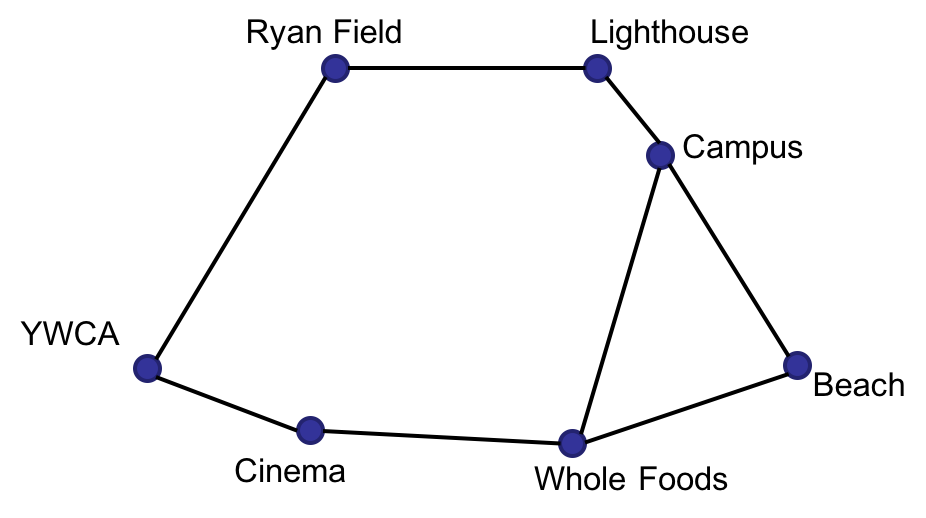

# Assignment 3—Search

## Back Story

You work at a food delivery start-up called BigByte. The company consists of two people, you and Willie,
both alumni of Nerdwestern University located in Heavanston. Of the two, you take care of the software engineering
and Willie handles the rest.

BigByte's target client restaurants and ordering customers are all based in Heavanston,
which has a handful of landmarks and a heavily fluctuating traffic pattern. To ensure that your delievery fleet
works efficiently, Willie asked you to come up with a route planning system.

All major map services are expensive and your start-up begins its services in a week,
so you'll have to come up with something yourself and do it fast.
Fortunately, Restaurants and Heavanston residents all live close to landmarks, and you only need to tell delivery
drivers how to best reach one landmark from another. You have a printed map of all Heavanston roads
and data from a traffic survey maintained by University Archive. For you, that means you only need to
write one more piece of software before the launch: an implementation of the **A\* algorithm**
that finds the best way to travel between any pair of landmarks in town.

## Task Parameters

A diagram explaining the relative position of major landmarks of Heavanston is shown below.



Your A\* algorithm will calculate fastest route between any pairs of the landmarks.
You will be given two routing maps as inputs. The first map specifies the straight-line distance
between two landmarks (Willie measured the printed map and did the data entry);
we will refer to this as the **distance map**. The second map is based on the data from the Archive traffic survey.
It specifies the expected time it takes a driver to go from one landmark to a neigbhoring landmark;
we will refer to this as the **time map**.

When passed to your A\* implementation, both the distance map and the time map are stored in the
same format (a Python dictionary). The following is an example time map.

```python
Time_map = {
'Campus':
	{'Campus':None,'Whole_Food':4,'Beach':3,'Cinema':None,'Lighthouse':1,'Ryan Field':None,'YWCA':None},
'Whole_Food':
	{'Campus':4,'Whole_Food':None,'Beach':4,'Cinema':3,'Lighthouse':None,'Ryan Field':None,'YWCA':None},
'Beach':
	{'Campus':4,'Whole_Food':4,'Beach':None,'Cinema':None,'Lighthouse':None,'Ryan Field':None,'YWCA':None},
'Cinema':
	{'Campus':None,'Whole_Food':4,'Beach':None,'Cinema':None,'Lighthouse':None,'Ryan Field':None,'YWCA':2},
'Lighthouse':
	{'Campus':1,'Whole_Food':None,'Beach':None,'Cinema':None,'Lighthouse':None,'Ryan Field':1,'YWCA':None},
'Ryan Field':
	{'Campus':None,'Whole_Food':None,'Beach':None,'Cinema':None,'Lighthouse':2,'Ryan Field':None,'YWCA':5},
'YWCA':
	{'Campus':None,'Whole_Food':None,'Beach':None,'Cinema':3,'Lighthouse':None,'Ryan Field':5,'YWCA':None}}
```

In this example, the traffic time between Campus and Beach is `3`. `None` indicates that there is no road which
directly connects the two landmarks. Off-road driving is prohibited by local law, so drivers must only take the
roads marked on the diagram above. Combining this legal requirement and with the volatile traffic pattern of
Heavanston, it is certain that the distance map can only be used as a heuristic for the A\* algorithm.
It is also noteworthy that the time it takes traveling on the two sides of the same road is most likely different.

## Assignment Deliverable

For this assignment, you must implement the function `a_star_search(dis_map, time_map, start, end)` in `student_code.py`.
The function must return a path from landmark `start` to landmark `end`. Note that:
* The result must be a list of strings. Each string contains _only_ the name of a landmark. The order of the strings in the list denotes the order in which the landmarks are reached along the path;
* The result list should _begin_ with the name of the `start` landmark and _terminate_ with the name of the `end` landmark. (Thus, the path from `A` to `A` is the list `[A]`);
* The cost of a path between two connected landmarks is the total expected traffic time that must be spent traveling all landmarks in the order specified by the path.
* In the case of ties when considering which nodes to expand next, you should expand the tied nodes alphabetically.
* You can assume that all test cases will give you start/end nodes that are both present on the map and connectable.

Your `a_star_search` function must implement an A\* **graph** search algorithm, and it must use the `expand` function in `expand.py`. With the `expand` function, we can verify that the correct number of nodes are expanded. As a reminder, graph search algorithms do not expand nodes that have already been visited.

Furthermore, the Autograder assumes that all of the code that is needed to properly grade your assignment submission is included in `student_code.py`. Please adhere to this constraint as you develop your response.

Additionally, you should feel invited to use built-in Python modules for your data structures, but you need to implement A\* yourself.
